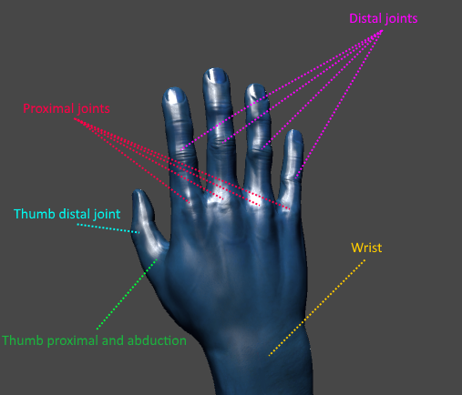
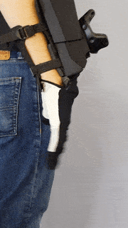
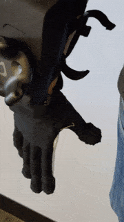

## Introduction
The Maestro C API allows developers to build tools and applications that utilize the Maestro glove's motion capture and haptic functionality.

## Terminology

The documentation and SDK refer to different joints in the hand and finger using the terminology depicted above. The first joint on the thumb (where the thumb connects to the palm) has both a proximal rotation that controls inward rotation, much like the finger proximal joints, as well as an abduction rotation that controls the side-to-side rotation of the thumb. These two rotations paired together allow for the circular rotation of the thumb.

## Usage

### Initial Setup

There are configuration files that must be in place for the API to function properly. These are copied to the correct locations by the <a href="https://github.com/Contact-Control-Interfaces/maestro-installer">Maestro installer</a> (be sure to run the installer associated with the API version you're using).

### Configuration

The configuration files for the Maestro can be found in `%%LOCALAPPDATA%\Contact Control Interfaces\Maestro\[VERSION]\Configuration` where `[VERSION]` is the version of the SDK that you're working with. For the 0.1 Alpha version, the configuration is located at `%%LOCALAPPDATA%\Contact Control Interfaces\Maestro\v0.1a\Configuration`.

Inside of the configuration directory, you'll find two files: `left_maestro_rotation_ranges.txt` and `right_maestro_rotation_ranges.txt`. In most cases the contents of these two files should be the same, but you're able to configure the rotation ranges per-glove if desired.
The contents of the rotation range files are used for calculating the rotation of individual joints.

Each line in the file represents a single joint with a comma delimited string of three values: the name of the joint, the minimum rotation, and the maximum rotation. The rotations themselves are specified as positive or negative floating-point numbers in the inclusive range `(0, 1)`, where `0` is no rotation, and `1` is a complete rotation (360 degrees). 
An example of the contents of one of these  rotation range files can be seen below:

	Wrist,-0.12,0.12
	IndexProximal,-0.06,0.3
	MiddleProximal,-0.06,0.3
	RingProximal,-0.06,0.3
	LittleProximal,-0.06,0.3
	ThumbMetacarpal,-0.15,0.25
	ThumbAbduction,-0.06,0.075
	
### Development
	
To use the API, you must include the shared library and include the provided header files.

1. The Maestro detection thread must be running for plugged in gloves to be detected. This is as simple as calling `start_maestro_detection_service()`.
2. Now that the service is running, you can use `is_glove_connected(intptr_t maestroPtr)` to determine if a glove is connected. Pass in the appropriate glove pointer obtained by `get_left_glove_pointer()` or `get_right_glove_pointer()`.
3. Once a glove is connected, the glove must be calibrated before the motion capture data can be used. See <a href="#calibrationHeader">Calibration</a>

Once the Maestro is calibrated, you may retrieve motion capture data for your use in your application, as well as control the vibration and force-feedback haptic systems. For details, view the appropriate modules in the navigation on the left of the page.

Here's a single C program that continously outputs the wrist rotation:

~~~c
#include <stdio.h>
#include "maestro.h"

bool calibrate_wrist(intptr_t rightGlove)
{
    bool result = false;

    printf("Beginning wrist calibration. Hit enter when done...");

    if (start_wrist_calibration(rightGlove)) {
        getchar();
        result = end_wrist_calibration(rightGlove);
    }

    return result;
}

bool calibrate_fingers(intptr_t rightGlove)
{
    bool result = false;

    printf("Beginning proximal calibration. Hit enter when done...");

    if (start_proximal_calibration(rightGlove)) {
        getchar();
        result = end_proximal_calibration(rightGlove);
    }

    return result;
}

bool calibrate_thumb(intptr_t rightGlove)
{
    bool result = false;

    printf("Beginning thumb calibration. Hit enter when done...");

    if (start_thumb_calibration(rightGlove)) {
        getchar();
        result = end_thumb_calibration(rightGlove);
    }

    return result;
}

int main(int argc, char *argv[])
{
    int exit_status = EXIT_SUCCESS;

    //Start the Maestro detection thread. This thread will handle connecting/disconnecting Maestro gloves
    if (start_maestro_detection_service()) {
        intptr_t rightGlove = get_right_glove_pointer();

        printf("Waiting for right glove...\n");

        //Wait until right glove is connected
        while (!is_glove_connected(rightGlove)) {
            Sleep(250);
        }

        printf("Right glove found.\n");

        //Calibrate the Maestro
        if (calibrate_wrist(rightGlove)) {
            if (calibrate_fingers(rightGlove)) {
                if (calibrate_thumb(rightGlove)) {

                    printf("Maestro calibration completed!\n");

                    //Output wrist rotation
                    while(true) {
                        printf("Wrist rotation: %f\n", get_wrist_proximal_rotation(rightGlove));
                        Sleep(100);
                    }
                }
            }
        }
    } else {
        fprintf(stderr, "Failed to start Maestro detection thread.\n");
        exit_status = EXIT_FAILURE;
    }

    return exit_status;
}
~~~

### Calibration
The calibration process consists of three steps: calibrating the wrist, and then the proximal joints of the fingers and thumb, and then the thumb. 
**The alpha release of the Maestro does not include independent distal joint tracking.**

1. Calibrating the wrist: move your wrist through a full range of motion up and down. Try to keep your fingers flat (straight out) during this motion. 
2. Calibrating the fingers: move your fingers through a full range of motion from flat to curled inward like a fist. 
3. Calibrating the thumb: move your thumb through a full range of circular motion. 

You can repeat each of these motions during their respective calibration step until satisfied with the resulting calibration. You do not need to move at the same speed as the examples shown; as long as you don't move too quickly and/or inconsistently the quality of the calibration should not be noticeably impacted.

## Troubleshooting and debugging

### Logging

The Maestro API generates log files to help aid debugging in the event that glove is not properly connecting.

The log files for the Maestro can be found in `%%LOCALAPPDATA%\Contact Control Interfaces\Maestro\[VERSION]\Logs`. Inside the `Logs` folder there will be log files of the format `maestro-[TIMESTAMP].log`, where `[TIMESTAMP]` is the local date on which that particular log file was generated.

The log messages themselves are formatted as follows: `[LONG TIMESTAMP][CATEGORY]: [MESSAGE]`. 
The category is included to aid readability, and usually the `ERROR` category will prove to be most useful in debugging. The category `ERROR` will also log the last error from Windows API. <a href="https://msdn.microsoft.com/en-us/library/windows/desktop/ms681381(v=vs.85).aspx">A complete list of all possible Windows system error codes can be found here.</a>
Should the glove be successfully detected but fail to start, the log files will return one of the following error codes. 
Note that errors 5-10 deal with the motion ranges file specifically:

    0 - Success (should never be logged, as this is not an error)
    1 - Glove failed to start because it was already running.
    2 - Failed to connect to the glove, usually because it was not plugged in.
    3 - Failed to create a new thread for the connected glove.
    4 - Deprecated
    5 - Failed to find the appropriate motion range file, i.e. `left_maestro_rotation_ranges.txt` or `right_maestro_rotation_ranges.txt`.
    6 - A required rotation range entry is missing. For example, the `IndexProximal` line is missing.
    7 - A required rotation range entry is invalid. For example, having an extra comma or value.
    8 - A rotation range entry is invalid, for instance having non-numeric characters in the rotation values.
    9 - A rotation range is valid, but the values are in the incorrect order, that is to say not ascending.
    10 - An entry's name is invalid, for instance having `IndexPrimoxal` instead of `IndexProximal`. Usually indicates a typo or extra line.
	
These files are generated purely to help debug easy to fix issues with the system or configuration, and can be deleted without issue if need be. Please note that these logs may not encompass any error that can occur, but should help diagnose most errors. Also please note that these logs report only on the Maestro device itself, and will give no insight into your calibration, or any project-related configuration that may be affecting your development. 

<strong>Please contact us at support@contactci.co with any questions.</strong>
